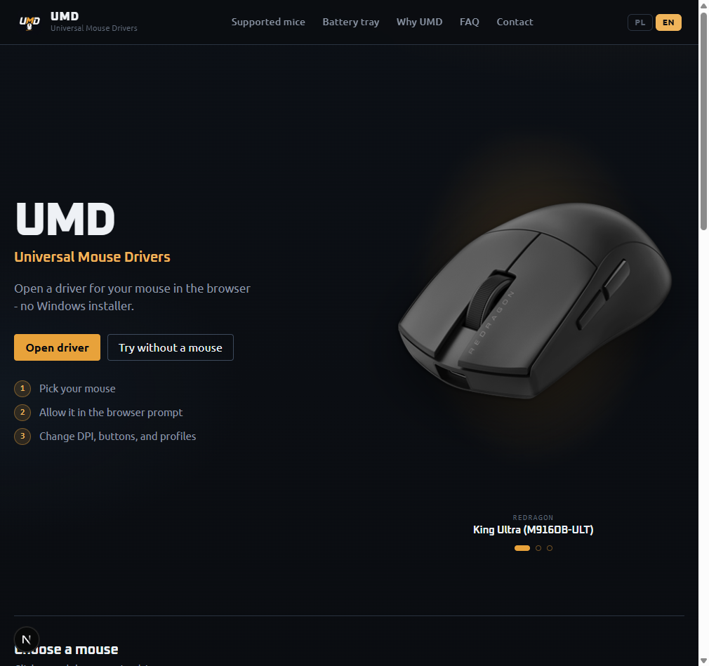
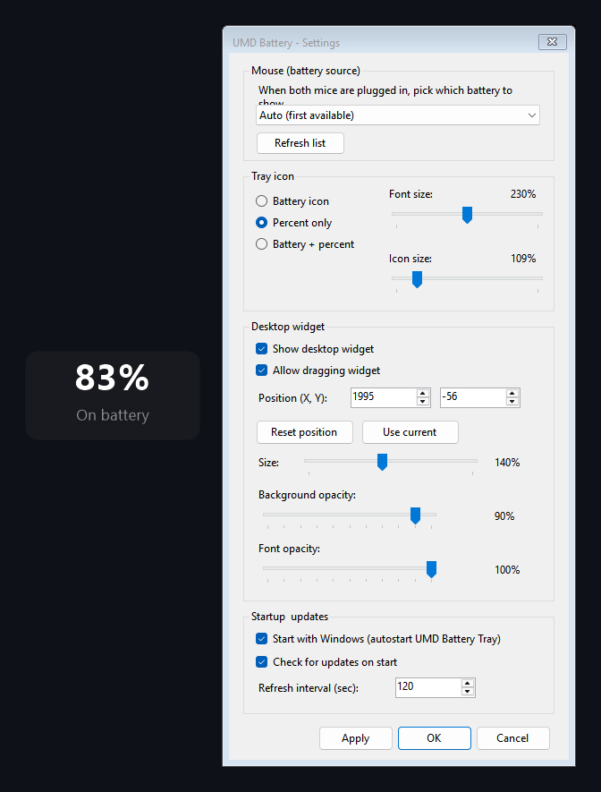

# Universal Mouse Drivers (UMD)

**Browser WebHID drivers for gaming mice** - configure DPI, buttons, polling rate and onboard profiles in Chrome / Edge. No heavy OEM installer.

Optional **Windows battery tray** (.exe) when you want battery % without keeping the browser open.

## Screenshots

### Web app (homepage)

### Windows Battery Tray

---

## Use the app

**https://mouse.vxh.pl**

- Polish: [mouse.vxh.pl/pl](https://mouse.vxh.pl/pl)
- English: [mouse.vxh.pl/en](https://mouse.vxh.pl/en)
- Why UMD exists: [mouse.vxh.pl/en/why](https://mouse.vxh.pl/en/why)
- Battery Tray (download + docs): [mouse.vxh.pl/en/tray](https://mouse.vxh.pl/en/tray) · [PL](https://mouse.vxh.pl/pl/tray)

---

## Supported mice

| Mouse | SEO page | Status |
|-------|----------|--------|
| **Redragon King Ultra** (M916OB-ULT) | [PL](https://mouse.vxh.pl/pl/mice/redragon-king-ultra) · [EN](https://mouse.vxh.pl/en/mice/redragon-king-ultra) | **Live** |
| **Rampage Blitz Ultimate** | [PL](https://mouse.vxh.pl/pl/mice/rampage-blitz-ultimate) · [EN](https://mouse.vxh.pl/en/mice/rampage-blitz-ultimate) | **Live** |
| **G-Wolves Fenrir Max 8K** | [PL](https://mouse.vxh.pl/pl/mice/gwolves-fenrir-max) · [EN](https://mouse.vxh.pl/en/mice/gwolves-fenrir-max) | WIP |
| **Logitech PRO X SUPERLIGHT** (gen1) | [PL](https://mouse.vxh.pl/pl/mice/logitech-pro-x-superlight) · [EN](https://mouse.vxh.pl/en/mice/logitech-pro-x-superlight) | WIP |

**Live** = full WebHID configurator + battery tray on hardware. **WIP** = in progress / partial support.

Want your mouse on the list? Open a **[Device request](https://github.com/skullboypl/universal-mouse-drivers/issues/new?template=device_request.yml)** issue.

---

## UMD Battery Tray (Windows .exe)

Light, EV-signed helper for **system-tray battery** + optional always-on-top **desktop widget**. Same HID protocols as the web app (HidSharp). Does **not** replace the browser driver for DPI / buttons / profiles.

| | |
|--|--|
| **Download** | [UmdBatteryTray.exe](https://mouse.vxh.pl/api/downloads/UmdBatteryTray.exe) |
| **Docs (EN)** | [mouse.vxh.pl/en/tray](https://mouse.vxh.pl/en/tray) |
| **Docs (PL)** | [mouse.vxh.pl/pl/tray](https://mouse.vxh.pl/pl/tray) |
| **Mice** | King Ultra · Blitz Ultimate · Fenrir Max · PRO X SUPERLIGHT (gen1 / `046D:C547`) |

**Features:** tray icon (battery / percent / both) · desktop widget · mouse picker · poll interval · Start with Windows · auto-update check on start · works with Settings on mouse.vxh.pl when the tray runs on the same PC.

Close G HUB / OMM / OEM apps / Chrome WebHID if the tray cannot open the mouse (exclusive HID).

Site UI is **English + Polish** (header switch). Tray settings UI is English.

---

## Feedback

This repository is the **public feedback hub** for UMD (SEO + community).

| Channel | Use for |
|---------|---------|
| **[GitHub Issues](https://github.com/skullboypl/universal-mouse-drivers/issues)** | Bugs, feature ideas, device requests |
| **[Discussions](https://github.com/skullboypl/universal-mouse-drivers/discussions)** | Questions, tips, general chat |
| **Website contact** | [mouse.vxh.pl/#contact](https://mouse.vxh.pl/pl#contact) |
| **Email** | [github@skullmedia.pl](mailto:github@skullmedia.pl?subject=UMD%20feedback) |
| **TikTok** | [@skullboypl](https://www.tiktok.com/@skullboypl) |

### Before opening an issue

1. Try the live app: https://mouse.vxh.pl
2. Use **Chrome or Edge** (desktop) on https://mouse.vxh.pl
3. Close OEM software (G HUB, OMM, vendor drivers) that may lock the HID device
4. Note mouse model + how you connect (wired / dongle)

---

## What is UMD?

Universal Mouse Drivers is a **web configurator** for gaming mice:

- WebHID in the browser (Wooting-style model)
- Per-device protocol reverse engineering when OEM apps are closed / heavy
- One product shell for multiple brands
- Optional Windows battery tray helper

Read more: **[Why UMD exists](https://mouse.vxh.pl/en/why)** · **[Battery Tray](https://mouse.vxh.pl/en/tray)**

---

## FAQ (short)

**Do I need to install Windows software?**  
No for configuration - use Chrome/Edge. An optional [Battery Tray](https://mouse.vxh.pl/en/tray) exists only for system-tray / widget battery.

**Is it safe?**  
UMD only opens whitelisted VID:PID pairs for the selected mouse. Other HID devices are not claimed.

**Where is the source of the web app?**  
Product site: https://mouse.vxh.pl - this GitHub repo is for **README, SEO discovery, and feedback**.

---

## License / copyright

Copyright © 2026 - SkullMedia Artur Spychalski  
Website: https://mouse.vxh.pl  
GitHub profile: https://github.com/skullboypl
